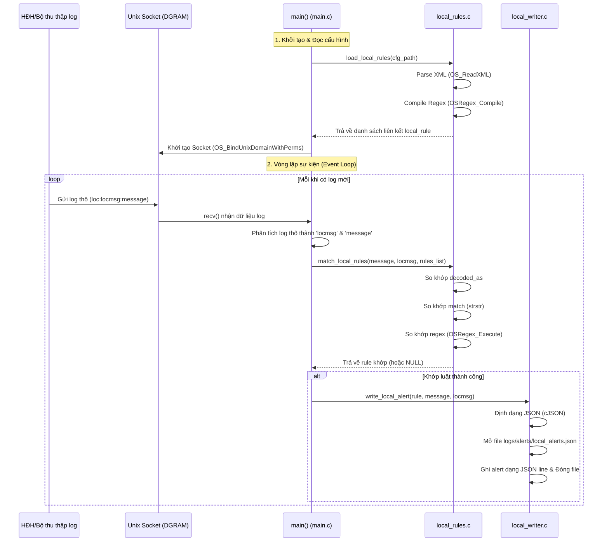

# Kế hoạch triển khai: Module Phân tích & So khớp Luật Cục bộ (Local Analysis Engine) trên Wazuh Agent (Giai đoạn 1: Standalone Agent)

Ý tưởng cốt lõi là chuyển đổi luồng xử lý dữ liệu từ tập trung (Centralized) sang phân tán/biên (Edge/Decentralized). 

Trong giai đoạn đầu, để giảm thiểu độ phức tạp và tách biệt hoàn toàn với Wazuh Manager, chúng ta sẽ xây dựng module **`wazuh-local-analysisd`** hoạt động hoàn toàn độc lập (Standalone) trên Agent. Tiến trình này sẽ tự nhận log, tự giải mã (decode) và so khớp luật (rules), sau đó ghi nhận cảnh báo (alerts) trực tiếp ra file log cục bộ trên Agent mà không cần truyền tải về Manager.

---

## Kiến trúc Giai đoạn 1 (Standalone Agent)

```mermaid
flowchart TD
    subgraph Wazuh Agent (Mới - Standalone)
        direction TB
        subgraph Data_Collectors [Bộ thu thập dữ liệu]
            LC[wazuh-logcollector]
            SC[wazuh-syscheckd]
            MOD[wazuh-modulesd]
        end

        MQ[(Unix Domain Socket<br>/var/ossec/queue/sockets/queue)]

        subgraph LA [wazuh-local-analysisd]
            sock[Lắng nghe socket]
            rules_list[(Rules & Decoders<br>local_rules.xml)]
            engine{Rules Engine}
            writer[local_writer]
        end

        alerts_file[(logs/alerts/local_alerts.json)]
        agent_log[(logs/ossec.log)]
    end

    LC -->|Ghi log thô| MQ
    SC -->|Ghi log thô| MQ
    MOD -->|Ghi log thô| MQ
    MQ -->|Đọc log tuần tự| sock
    rules_list -->|Nạp XML & compile Regex| engine
    sock -->|Phân tích cú pháp log| engine
    
    engine -->|Khớp luật| writer
    engine -.->|Không khớp| Discard[Bỏ qua sự kiện]
    
    writer -->|Ghi JSON line| alerts_file
    writer -->|In cảnh báo bằng minfo| agent_log
```

### So sánh Luồng Giai đoạn 1 vs Tương lai

| Khía cạnh | Giai đoạn 1 (Hiện tại) | Giai đoạn 2 (Tương lai) |
| :--- | :--- | :--- |
| **Gửi về Manager** | **Không** (Tách biệt hoàn toàn) | Có (Chỉ gửi cảnh báo quan trọng qua `agentd`) |
| **Unix Socket** | `local-analysisd` chiếm socket chính `/var/ossec/queue/sockets/queue` | `local-analysisd` chiếm socket chính, chuyển tiếp sang `alerts_queue` cho `agentd` |
| **Đầu ra cảnh báo** | Ghi trực tiếp ra file JSON cục bộ trên Agent | Gửi về Manager + Ghi file cục bộ |
| **Đồng bộ luật** | Cấu hình thủ công tại thư mục `/var/ossec/etc/` của Agent | Tự động đồng bộ từ Manager xuống qua thư mục `shared/` |

### Tương tác giữa `wazuh-logcollector` và `wazuh-local-analysisd`

Dữ liệu log thu thập bởi `wazuh-logcollector` được chuyển tiếp tới `wazuh-local-analysisd` qua cơ chế giao tiếp liên tiến trình (IPC) bằng Unix Domain Socket (DGRAM):
* **Phía Gửi (`wazuh-logcollector`)**:
  - Tại [main.c](file:///home/wazuh/myproject/wazuh-4.14.5/src/logcollector/main.c#L190), socket ghi được mở thông qua:
    ```c
    logr_queue = StartMQ(DEFAULTQUEUE, WRITE, INFINITE_OPENQ_ATTEMPTS);
    ```
    với `DEFAULTQUEUE` trỏ tới `"queue/sockets/queue"` (file socket Unix Domain).
  - Khi thu thập log (như syslog, mysql, v.v.), `logcollector` đẩy vào queue nội bộ của nó. Sau đó, thread xử lý chính trong [logcollector.c](file:///home/wazuh/myproject/wazuh-4.14.5/src/logcollector/logcollector.c#L1940) sẽ pop log ra và gửi đi bằng hàm:
    ```c
    SendMSGtoSCK(logr_queue, message->buffer, message->file, message->queue_mq, message->log_target);
    ```
    Hàm này thực hiện định dạng lại bản tin và ghi trực tiếp vào socket thông qua `OS_SendUnix`.
* **Phía Nhận (`wazuh-local-analysisd`)**:
  - Tại [main.c](file:///home/wazuh/myproject/wazuh-4.14.5/src/local-analysisd/main.c#L124), bộ phân tích cục bộ bind và lắng nghe trên socket này:
    ```c
    int sock = OS_BindUnixDomainWithPerms(socket_path, SOCK_DGRAM, OS_MAXSTR + 512, uid, gid, 0660);
    ```
  - Tiến trình liên tục đọc bằng hàm `recv(sock, msg, OS_MAXSTR, 0)` trong vòng lặp vô hạn để tiếp nhận và phân tích cú pháp các bản tin log thô được gửi đến.

---

## Các thành phần thay đổi đề xuất

Để hiện thực hóa Giai đoạn 1 độc lập, chúng ta sẽ xây dựng động cơ chạy trên Agent kế thừa từ core engine của `wazuh-analysisd` nhưng loại bỏ hoàn toàn các module kết nối mạng hoặc tương tác với Manager.

### 1. [NEW] Bộ phân tích cục bộ `wazuh-local-analysisd` (`src/local-analysisd/`)
Tạo một daemon mới biên dịch trực tiếp cho Agent (Đã triển khai xong).

#### Các file đã được phát triển:
- `[NEW]` [main.c](file:///home/wazuh/myproject/wazuh-4.14.5/src/local-analysisd/main.c): Khởi tạo daemon, quản lý luồng đọc sự kiện tuần tự từ Unix socket và phối hợp với rules engine.
- `[NEW]` [local_rules.h](file:///home/wazuh/myproject/wazuh-4.14.5/src/local-analysisd/local_rules.h) & [local_rules.c](file:///home/wazuh/myproject/wazuh-4.14.5/src/local-analysisd/local_rules.c): Đọc và phân tích file XML rules, so khớp log bằng substring (`match`) hoặc `OSRegex` (`regex`), lọc theo decoder (`decoded_as`).
- `[NEW]` [local_writer.h](file:///home/wazuh/myproject/wazuh-4.14.5/src/local-analysisd/local_writer.h) & [local_writer.c](file:///home/wazuh/myproject/wazuh-4.14.5/src/local-analysisd/local_writer.c): Xuất các cảnh báo khớp luật ra tệp log JSON line cục bộ (`logs/alerts/local_alerts.json`) bằng thư viện `cJSON`.

### 2. [MODIFY] Build System (`src/Makefile`)
- Bổ sung cấu hình biên dịch cho `wazuh-local-analysisd` khi build target `agent`.
- Liên kết các module XML parser, Regex (`os_regex`), và helper utilities hiện có vào binary mới này.

---

## Các Bước Triển Khai Chi Tiết (Proposed Changes)

### Bước 1: Thiết lập cấu trúc thư mục và tích hợp Makefile

#### [NEW] [local-analysisd](file:///home/wazuh/myproject/wazuh-4.14.5/src/local-analysisd)
- Tạo thư mục `src/local-analysisd/` để chứa mã nguồn chính.

#### [MODIFY] [Makefile](file:///home/wazuh/myproject/wazuh-4.14.5/src/Makefile)
- Định nghĩa target `wazuh-local-analysisd`.
- Cấu hình biên dịch để tự động đóng gói daemon này vào gói cài đặt của Agent.

### Bước 2: Triển khai động cơ giải mã và so khớp tĩnh
- Thiết lập cơ chế đọc file cấu hình XML đơn giản trên Agent để nạp decoders và rules.
- Tận dụng `libwazuhanalysis` (hoặc liên kết trực tiếp các file nguồn của `analysisd`) để chạy so khớp regex mà không cần các cấu trúc phức tạp liên quan đến Manager (như `integratord` hay `active-response`).

### Bước 3: Ghi log cảnh báo cục bộ
- Viết module `local_writer.c` để sinh file log cảnh báo tại đường dẫn `/var/ossec/logs/alerts/local_alerts.json` trên máy Agent với định dạng JSON tương thích để dễ dàng phân tích hoặc tích hợp sau này.

---

## Kế hoạch Xác minh (Verification Plan)

### Kiểm thử tự động (Automated Verification)
Chúng ta sử dụng một kịch bản kiểm thử tự động bằng Python tại [local_analysis_test.py](file:///root/.gemini/antigravity-ide/brain/694dfd1d-5bea-4bbb-815f-580c19ade5e9/scratch/local_analysis_test.py) để tự động kiểm thử toàn bộ vòng đời của dữ liệu:
1. **Biên dịch daemon**:
   ```bash
   cd src/
   make wazuh-local-analysisd
   ```
2. **Chạy testcase tự động (yêu cầu quyền `root` / `sudo`)**:
   ```bash
   sudo python3 /root/.gemini/antigravity-ide/brain/694dfd1d-5bea-4bbb-815f-580c19ade5e9/scratch/local_analysis_test.py
   ```
   Kịch bản kiểm thử sẽ tự động:
   - Khởi chạy daemon `wazuh-local-analysisd` trên socket test riêng biệt (`local_test.sock`) để tránh xung đột hệ thống.
   - Gửi các bản tin log giả lập (matching và non-matching) vào socket.
   - Xác thực số lượng alert được ghi nhận và tính chính xác của dữ liệu JSON trong `logs/alerts/local_alerts.json`.

### Kiểm thử thủ công trên máy Agent (Manual Verification)
1. **Biên dịch độc lập:**
   ```bash
   cd src/
   make TARGET=agent
   ```
2. **Khởi chạy thử nghiệm:**
   - Dừng tiến trình `wazuh-agentd` nếu đang chạy (để tránh xung đột socket).
   - Chạy `wazuh-local-analysisd` bằng tay dưới quyền root.
3. **Mô phỏng sự kiện:**
   - Gửi các dòng log mẫu trực tiếp vào Unix socket `/var/ossec/queue/sockets/queue` bằng lệnh `logger` hoặc một script python gửi socket trực tiếp.
4. **Kiểm tra đầu ra:**
   - Đọc tệp `/var/ossec/logs/alerts/local_alerts.json` để xác minh xem cảnh báo có được sinh ra chính xác tương ứng với các luật đã định nghĩa hay không.

---

## Luồng dữ liệu & Các hàm chi tiết (Data Flow & Function Details)

Dưới đây là sơ đồ tuần tự thể hiện luồng dữ liệu từ lúc log thô được gửi cho tới khi cảnh báo được ghi ra tệp JSON cục bộ:



### Chi tiết các Hàm xử lý

#### 1. Module [main.c](file:///home/wazuh/myproject/wazuh-4.14.5/src/local-analysisd/main.c)
* **`main(int argc, char **argv)`**:
  - Nhận tham số cấu hình (tệp XML rules, đường dẫn socket).
  - Sử dụng `w_homedir()` và `chdir()` để thay đổi thư mục làm việc về gốc cài đặt của Wazuh.
  - Gọi `load_local_rules()` để nạp luật.
  - Tạo socket bằng `OS_BindUnixDomainWithPerms()`.
  - Thực hiện hạ quyền tiến trình (`Privsep_SetUser`/`Privsep_SetGroup`) để bảo vệ hệ thống.
  - Chạy vòng lặp vô hạn, gọi `recv()` để đọc dữ liệu thô từ socket, phân tích thành các trường `locmsg` (tên bộ thu thập) và `message` (log gốc), sau đó gọi động cơ so khớp luật và động cơ ghi cảnh báo.

#### 2. Module [local_rules.c](file:///home/wazuh/myproject/wazuh-4.14.5/src/local-analysisd/local_rules.c)
* **`local_rule *load_local_rules(const char *xml_path)`**:
  - Sử dụng hàm `OS_ReadXML()` của Wazuh để nạp và phân tích tệp XML chứa luật.
  - Sử dụng `OS_GetElementsbyNode()` để duyệt qua các cấu trúc `<group>` và `<rule>`.
  - Sử dụng `w_get_attr_val_by_name()` để lấy ID luật và Alert Level.
  - Gọi `OSRegex_Compile()` của thư viện Wazuh Regex để biên dịch trước các biểu thức chính quy được chỉ định trong thẻ `<regex>`.
  - Khởi tạo và liên kết các cấu trúc `local_rule` thành danh sách liên kết đơn.
* **`local_rule *match_local_rules(const char *log_msg, const char *decoder_name, local_rule *rules_list)`**:
  - Duyệt tuần tự qua danh sách liên kết các luật.
  - So khớp bộ giải mã `decoded_as` (nếu có).
  - So khớp chuỗi con tĩnh bằng `strstr()` đối với thẻ `<match>` (nếu có).
  - So khớp biểu thức chính quy bằng `OSRegex_Execute()` đối với thẻ `<regex>` (nếu có).
  - Trả về con trỏ trỏ tới luật bị khớp đầu tiên, hoặc `NULL` nếu không khớp luật nào.
* **`void free_local_rules(local_rule *rules)`**:
  - Giải phóng bộ nhớ động của danh sách liên kết và gọi `OSRegex_FreePattern()` để dọn dẹp các mẫu regex khi daemon dừng.

#### 3. Module [local_writer.c](file:///home/wazuh/myproject/wazuh-4.14.5/src/local-analysisd/local_writer.c)
* **`void write_local_alert(const local_rule *rule, const char *log_msg, const char *location)`**:
  - Sử dụng `strftime()` để định dạng nhãn thời gian hiện tại theo chuẩn ISO 8601.
  - Sử dụng thư viện `cJSON` để dựng nên cấu trúc alert bao gồm: `timestamp`, `rule` (id, level, description), `location` (tên decoder) và `full_log` (nội dung log gốc).
  - Chuyển đối tượng JSON thành chuỗi thô (`cJSON_PrintUnformatted()`).
  - Ghi nối tiếp (Append) chuỗi JSON này vào tệp tin `logs/alerts/local_alerts.json`.

---

