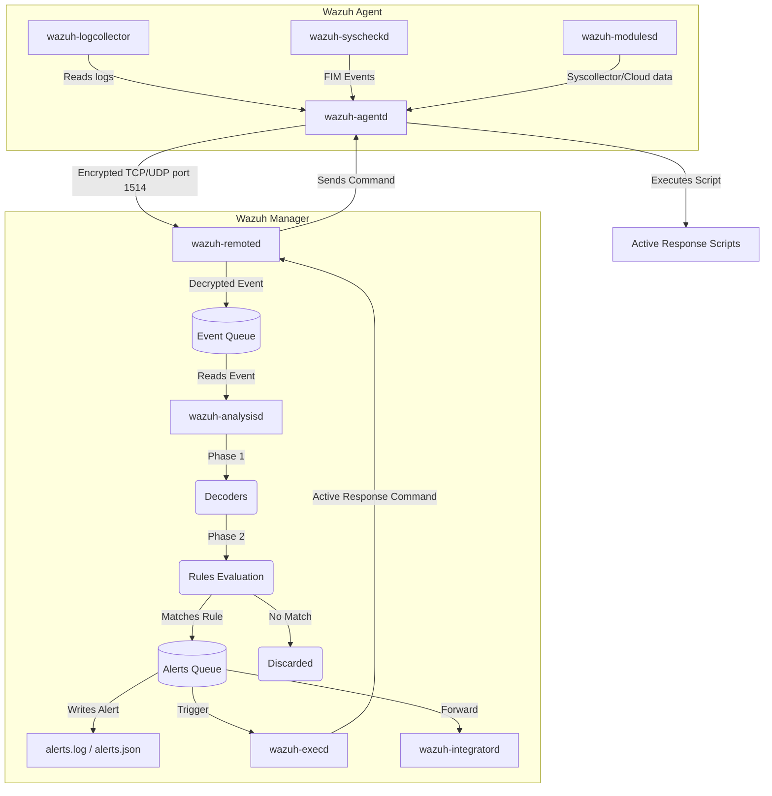

# Phân tích luồng hoạt động (Data Flow) & Source Code của Wazuh

Wazuh là một hệ thống mã nguồn mở chuyên dụng cho SIEM (Security Information and Event Management) và XDR. Dưới đây là bảng phân tích chi tiết về kiến trúc mã nguồn và luồng xử lý dữ liệu (Flow) bên trong lõi của Wazuh (phần lõi C/C++ nằm trong thư mục `src/`).

## 1. Cấu trúc thư mục mã nguồn chính (`src/`)

Hệ thống Wazuh được chia thành nhiều tiến trình (daemons) độc lập, giao tiếp với nhau chủ yếu thông qua các hàng đợi (queues) và Unix sockets. Dưới đây là các module quan trọng nhất trong source code:

- **`src/logcollector`** (`wazuh-logcollector`): Thu thập log từ các tệp tin cục bộ hoặc các dịch vụ hệ điều hành (Windows Event Log, Syslog).
- **`src/syscheckd`** (`wazuh-syscheckd`): Module giám sát tính toàn vẹn của tệp tin (FIM - File Integrity Monitoring) và Windows Registry.
- **`src/rootcheck`**: Module quét và phát hiện mã độc (rootkits, trojans).
- **`src/analysisd`** (`wazuh-analysisd`): **Trái tim của Wazuh Manager**. Tại đây diễn ra quá trình phân tích log, so khớp mã hóa (decoders) và đánh giá các luật (rules) để sinh ra cảnh báo (alerts).
- **`src/remoted`** (`wazuh-remoted`): Nhận các kết nối mã hóa từ Agents gửi lên (mặc định qua cổng 1514). Nó giải mã dữ liệu và đẩy vào queue cho `analysisd`.
- **`src/agent-auth` / `src/os_auth`** (`wazuh-authd`): Quản lý việc cấp phát chứng chỉ, xác thực và ghi danh (enrollment) cho các Agent mới (cổng 1515).
- **`src/wazuh_db`** (`wazuh-db`): Quản lý database nội bộ của Wazuh (sử dụng SQLite), dùng để lưu trữ trạng thái của agents, dữ liệu FIM, Syscollector.
- **`src/wazuh_modules`** (`wazuh-modulesd`): Tập hợp các module mở rộng (GCP, AWS, Azure, Vulnerability Detector, Syscollector).
- **`src/os_execd` & `src/active-response`** (`wazuh-execd`): Xử lý Active Response, nhận lệnh và kích hoạt các script để phòng vệ tự động (ví dụ: block IP).
- **`src/os_integrator`** (`wazuh-integratord`): Gửi các alerts sinh ra tới các nền tảng bên ngoài qua webhook (Slack, Jira, PagerDuty...).

---

## 2. Luồng xử lý dữ liệu (Wazuh Data Flow)

Dưới đây là vòng đời của một sự kiện (Event) kể từ khi được sinh ra tại máy Agent cho đến khi tạo thành Cảnh báo (Alert) trên Manager.

### Bước 1: Thu thập sự kiện tại Agent (Data Collection)
Các deamons chạy trên máy Agent (`wazuh-logcollector`, `wazuh-syscheckd`, `wazuh-modulesd`) liên tục thu thập dữ liệu về OS, logs và sự kiện thay đổi file. Chúng đóng gói sự kiện lại và chuyển cho `wazuh-agentd`.

### Bước 2: Chuyển tiếp tới Manager (Data Transmission)
`wazuh-agentd` sẽ mã hóa dữ liệu này bằng khóa chung (shared key) đã tạo ra ở bước đăng ký (enrollment) và truyền về phía Server qua giao thức TCP hoặc UDP (cổng 1514).

### Bước 3: Tiếp nhận và giải mã tại Server (Reception)
Tiến trình `wazuh-remoted` trên Wazuh Manager lắng nghe trên cổng 1514. Nó nhận gói tin, giải mã, xác thực Agent và sau đó chuyển thông tin nguyên thủy (raw event) vào hệ thống hàng đợi (`ossec.queue` hoặc Unix socket) để chờ xử lý.

### Bước 4: Phân tích sự kiện (Event Analysis)
Đây là công việc cốt lõi của `wazuh-analysisd`:
1. **Tiền xử lý (Pre-decoding):** Lọc ra các thông tin meta như hostname, ngày tháng, tên chương trình.
2. **Giải mã (Decoding):** Sử dụng các file XML cấu hình decoders để bóc tách luồng raw text thành các trường thông tin (srcip, dstuser, action, status, ...).
3. **Đánh giá luật (Rule Matching):** Đem các luồng đã giải mã đi đối chiếu với hệ thống Rules. Nếu khớp với một Rule có cấp độ cảnh báo (level) đủ cao, nó sẽ tạo ra một **Alert**.

### Bước 5: Đầu ra (Output / Alerting / Active Response)
Sau khi Alert được tạo ra:
- **Lưu trữ:** Ghi vào các file `/var/ossec/logs/alerts/alerts.log` và `alerts.json`. Sau đó có thể được Filebeat gom lại và đẩy lên Elastic Stack / Wazuh Indexer.
- **Cơ sở dữ liệu:** Ghi dữ liệu kiểm kê (inventory, FIM) vào `wazuh-db` bằng các socket local.
- **Active Response:** Nếu Rule có liên kết cấu hình chặn/phòng vệ tự động, một bản tin sẽ được đẩy qua `wazuh-execd` -> `wazuh-remoted` -> ngược lại `wazuh-agentd` để thực thi file bash/powershell nhằm ngắt kết nối IP độc hại hoặc khóa tài khoản.
- **Integrations:** Đẩy thông báo ra bên ngoài (Email, Slack, webhook) bằng `wazuh-integratord` hoặc `wazuh-maild`.

---

## 3. Kiến trúc Core bằng Code (C/C++)

Bạn có thể đào sâu vào các thư mục sau để hiểu tường tận code logic:

1. **`src/analysisd/`**: Nơi định nghĩa các hàm parse XML decoders (`decoders/`) và rules (`rules/`). Xem luồng vòng lặp chính nhận dữ liệu ở `analysisd.c`.
2. **`src/remoted/`**: Xem hàm `manager_init` trong `remoted.c` để thấy cách Wazuh quản lý thread pool cho các kết nối từ hàng ngàn agents cùng lúc, và cách mã hóa/giải mã thông qua `sec.c` (Secure connection).
3. **`src/wazuh_db/`**: Module C sử dụng thư viện SQLite3 thực hiện tác vụ CRUD siêu tốc, giao tiếp thông qua socket nội bộ. Mã nguồn bắt đầu ở `wazuh_db.c`.
4. **`src/wazuh_modules/`**: Nơi các nhà phát triển Wazuh hiện đại đang chuyển sang dùng C++14/C++17 để viết các tính năng chuyên sâu và tích hợp Cloud thay cho C thuần cũ kỹ.

Tài liệu này bao quát tổng quan kiến trúc, giúp bạn có một "bản đồ" khi theo vết (trace) bất kỳ tính năng nào trong hàng triệu dòng code C/C++ của Wazuh.
